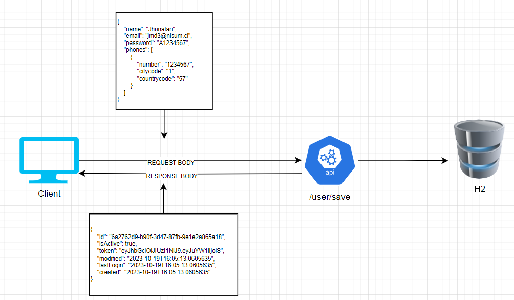
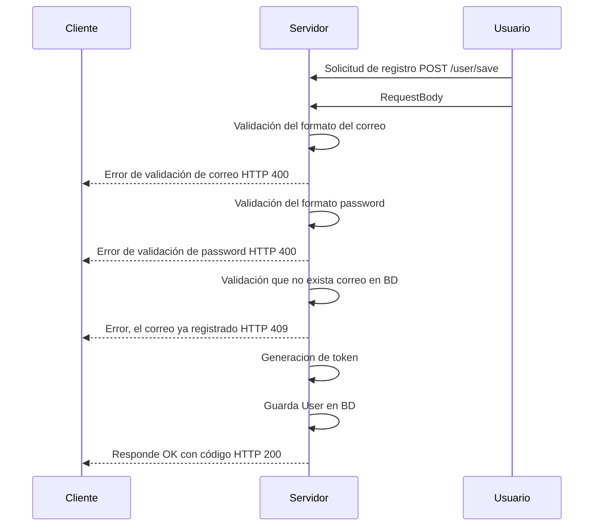

# Proyecto de Users

## Diagrama Proyecto



## Pre-Requisitos

Asegúrate de tener lo siguiente instalado y configurado:

- Java 11: Asegúrate de tener Java 11 instalado en tu sistema y configurado correctamente.
- IDE para proyectos Java: Por ejemplo, IntelliJ IDEA.
- Lombok: Asegúrate de tener Lombok instalado en su IDE.
- Maven: Asegúrate de tener Maven instalado para la gestión de dependencias , en este caso podria usar la version 3.8.1.

## Instalación

_Copiar y ejecutar el siguiente comando en una terminal git_

```bash
git clone https://github.com/jhonatanMD/ms-user.git
```

_Dirigirse al IDE y importar el archivo_

_En la ruta del proyecto ejecutar el siguiente comando para bajar las dependencias y luego dar un Build_
```
mvn clean install
```
_Visualización de modelos generados por swagger_
- Despues de haber ejecutado el comando anterior
- dirigirse al pom , dar clic derecho
- Seleccionar maven y Generate Sources and Update Folders

## Configuración del Puerto
```
server.port=8081
```
## Configuración en application.yml

En el archivo `application.yml` de la aplicación, se encuentra la configuración relacionada con las instrucciones de validación. A continuación, se muestra un ejemplo de cómo se configuran las reglas de validación en el archivo `application.yml`:

```properties

validate:
 email:
   regex: "^[A-Za-z0-9._%+-]+@nisum\\.cl$" #formato email personalizado
   #regex: "^[A-Za-z0-9._%+-]+@[A-Za-z0-9.-]+\\.[A-Za-z]{2,}$" #formato personalizado
   message: "debe tener el formato correcto , example@nisum.cl"
 password:
   uppercase:
     regex: "^(?=.*[A-Z].*).*"
     message: "debe contener al menos una letra en mayuscula"
   digit:
     regex: "^(?=.*[0-9].*).*"
     message: "debe contener al menos un digito"
   length:
     regex: "^(.){8,}"
     message: "debe tener una longitud minima de 8 caracteres"
```

## Ejecución

* Dentro del IDE buscar el main que se encuentra en la clase MsUserApplication.java darle click derecho y hacer correr programa (Run)

* Despues de Eso ir a postman y consumir la api : http://localhost:8081/user
  
* Ruta de collection [ms-user.postman_collection.json](ms-user.postman_collection.json)
## Ejecución con mvn

* Abrir la consola en la ruta del proyecto y ejecutar el comando

```bash 
mvn spring-boot:run
``` 
## Ejecución con docker


_Construir Proyecto_
```bash 
mvn clean package
``` 
_Ejecutar comando docker para crear la imagen_
```bash
docker build -t ms-user:v1 .
```
_Ejecutar comando para correr el contenedor que contiene la imagen del proyecto_
```bash 
docker run -p 8081:8081 ms-user:v1
``` 

## Documentación

* Para la documentación ir a la ruta : /swagger/open-api.yml
* To access the API documentation, navigate to [swagger-ms-user](http://localhost:8081/swagger-ui.html#/User).
* Se podra ver los endpoint de la api y su funcionalidad.


